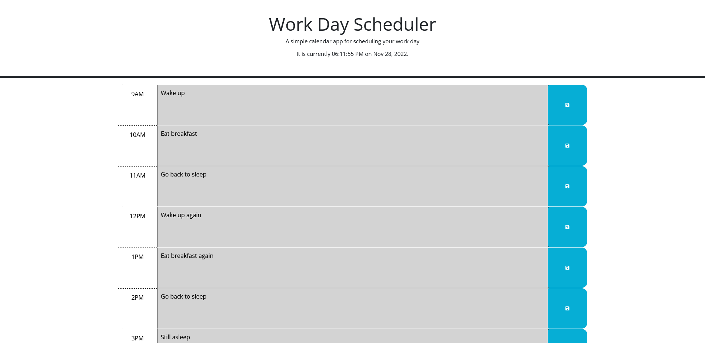

# Bug Free Potato
A work day scheduler.

## Description

An online task management program featuring savable tasks and time-dependent color-coding of the tasks. When the user enters in a task at certain hour into the textbox, the task can be saved into local storage which will persist until the user deletes or changes the task. Depending on the time of day, the task box will be color coded for whether or not a given task is in the future, present, or past.

Provide a short description explaining the what, why, and how of your project. Use the following questions as a guide:

This project was mainly for practicing using API (in this case Day.js) to modify HTML, and to test my skills in generating HTML elements actively through Javascript rather than passively hardcoding them into an HTML file. It was also good practice for thinking through how to use these actively generated elements with something like local storage, having the web page not only correctly associate different hour blocks with different entries in local storage but making sure those associations stay predictable every time the page is modified.

## Usage

In order to use the application, simply enter in the desired task at the desired hour the task should be started/completed, and click save on the right. The task can be overwritten with other tasks if one wishes.

## Credits

Credit is due to the MDN Web Docs and Day.js for their documentation.

## License

The last section of a high-quality README file is the license. This lets other developers know what they can and cannot do with your project. If you need help choosing a license, refer to [https://choosealicense.com/](https://choosealicense.com/).
